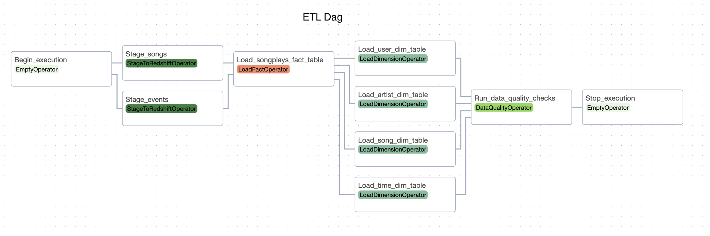

# de-udacity-nanodegree-project-05
Data Pipelines with Apache Airflow

# The Story

A music streaming company, Sparkify, has decided that it is time to introduce more automation and monitoring to their data warehouse ETL pipelines and come to the conclusion that the best tool to achieve this is Apache Airflow.

They have decided to bring you into the project and expect you to create high grade data pipelines that are dynamic and built from reusable tasks, can be monitored, and allow easy backfills. They have also noted that the data quality plays a big part when analyses are executed on top the data warehouse and want to run tests against their datasets after the ETL steps have been executed to catch any discrepancies in the datasets.

The source data resides in S3 and needs to be processed in Sparkify's data warehouse in Amazon Redshift. The source datasets consist of JSON logs that tell about user activity in the application and JSON metadata about the songs the users listen to.

# The ETL Dag



The ETL dag is composed by the following tasks:

- Begin_execution
- Staging tasks
> Copy data from S3 to staging tables in Redshift. Stage_songs and Stage_events tasks are run in parallel.
- Load fact table task
> Load songplays fact table in Redshift
- Load dimension tables tasks
> Load dimension tables in Redshift. Load_user_dim_table, Load_artist_dim_table, Load_song_dim_table, and Load_time_dim_table tasks are run in parallel.
- Run data quality checks task
- Stop execution

# Project Structure

```
├── .editorconfig
├── .gitignore
├── LICENSE
├── README.md
├── create_tables.sql
├── imgs
│   ├── etl_dag.png
├── dags
│   ├── create_tables_dag.py
│   ├── drop_tables_dag.py
│   ├── etl_dag.py
│   └── udac_example_dag_airflow1.py
├── docker-compose.yaml
└── plugins
    ├── __init__.py
    ├── helpers
    │   ├── __init__.py
    │   └── sql_queries.py
    └── operators
        ├── __init__.py
        ├── create_table.py
        ├── data_quality.py
        ├── drop_table.py
        ├── load_dimension.py
        ├── load_fact.py
        └── stage_redshift.py

6 directories, 21 files
```

## docker_compose.yml

Runs Airflow locally using Docker.

## create_tables.sql

SQL script that can used to create all the required tables in Redshift. Alternatively, one can run the `create_table_dag` in Airflow (see in the sequel).

## The `dags/` directory

- etl_dag.py
> This is the main dag where all the steps of the ETL are performed.

- udac_example_dag_airflow1.py
> This is the starter dag provided by Udacity.

- drop_tables_dag.py
> A helper dag that can be used to drop all the tables.

- create_tables_dag.py
> A helper dag that can be used to create all the tables. Alternatively, one can run the script `create_tables.sql` in the Redshift cluster to set all the tables.

## The `plugins/` directory

This directory contains the `operators` and `helpers` subdirectories.

### `plugins/operators`

Subpackage in which the reusable custom operators are defined.

- stage_redshift.py
> Defines the operator `StageToRedshiftOperator` that is used to copy data from a S3 path to staging tables in Redshift.

- load_fact.py
> Defines the operator `LoadFactOperator` that is used to load the fact table songplays using the staging tables.

- load_dimension.py
> Defines the operator `LoadDimensionOperator` that is used to load the dimension tables songs, artists, users, and time.

- data_quality.py
> Defines the operator `DataQualityOperator` that is used to run data quality checks at the last step of the ETL.

Other operators

- drop_table.py
> Defines the operator `DropTableOperator` that can be used to drop tables in the Redshift cluster.

- create_table.py
> Defines the operator `CreateTableOperator` that can be used to create tables in the Redshift cluster.

### `plugins/helpers`

- sql_queries.py
> Defines the insert queries and the create table queries that are used by the LoadDimensionOperator and the CreateTableOperator, respectively.

## Other files

Other files that compose the Project are:
- .editorconfig
- .gitignore
- LICENSE
- README.md

# Running the Project

It is necessary to have an AWS account, Docker and Docker Compose installed to run the Project.

## Setting AWS

- Create a user and attach the policies `AmazonRedshiftFullAcess` and `AmazonS3FullAccess` to them. Allow the user to connect to AWS using an access key. We will setup a connection to AWS within Airflow using these credentials (see in the sequel).
- Create a Redshift service role and attach the `AmazonS3FullAccess` policy to it.
- Create a Redshift cluster in AWS and associate the Redshift service role to it.

## Running Airflow in Docker

Just run the command in the Project root directory

```bash
$ docker-compose up -d
```

This launches many services. We will shortly describe only Airflow Webserver and Airflow Scheduler.

- Airflow WebServer: can be accessed in your Web browser at `http://localhost:8081`. To login, use `airflow` as username and password. From the Web UI one can execute the dags, add connections to AWS and to Redshift, set variables, and more.

> __Important__
> - A connection to AWS must be set using `aws_credentials` as the connection ID.
> - A connectio to the Redshift cluster must be set using `redshift` as the connection ID.

- Airflow Scheduler: the scheduler monitors all tasks and DAGs, then triggers the task instances once their dependencies are complete.

For more information, check the following [link](https://airflow.apache.org/docs/apache-airflow/stable/howto/docker-compose/index.html).
